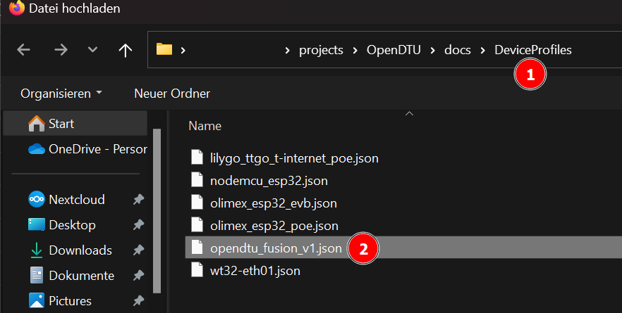
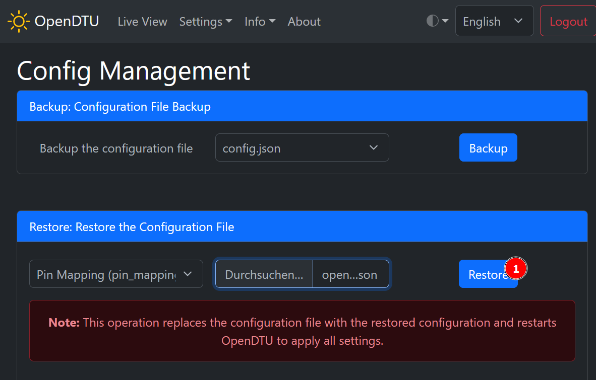
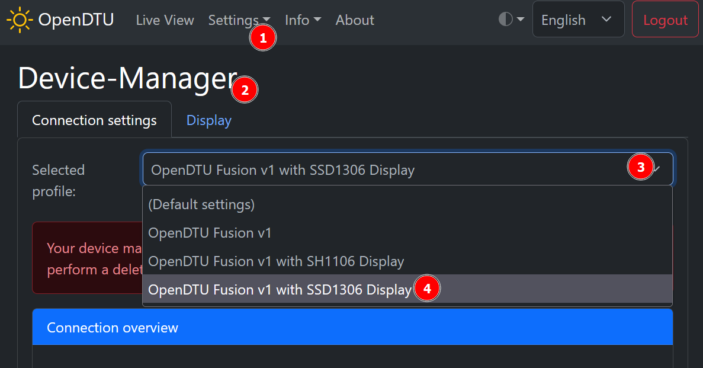
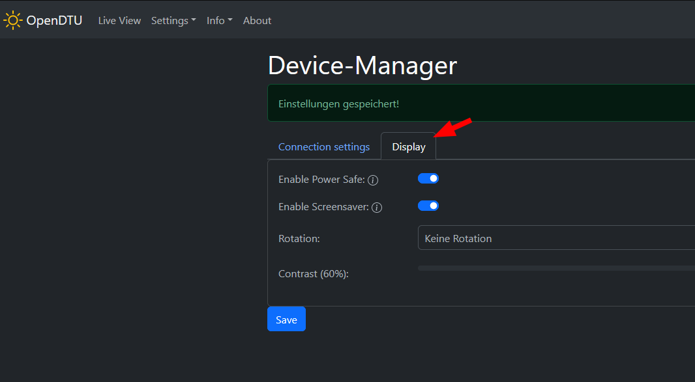

## Connecting to the board via Wifi
After a short period after reset or power-up, the generic OpenDTU access point should show up in your Wifi search,
where you can then connect and perform the setup as documented by Open/AhoyDTU (the number will change with every board).

Go to the network settings via the 'hamburger menu' in the top right.
Here you can then enter your own Wifi and proceed:

## Loading a Device Profile for the RF and Display Pinout

Navigate to Config Management

and choose pin mapping as the restore item

and select the file for the OpenDTU Fusion PCB from the repo or your custom file.
The official latest device profile is to be found here (use "download raw file" button in upper right corner of the file viewer to download): <https://github.com/tbnobody/OpenDTU/blob/master/docs/DeviceProfiles/opendtu_fusion.json>

Alternative link to raw, downloadable file (right click, Save Target As...): <https://raw.githubusercontent.com/tbnobody/OpenDTU/master/docs/DeviceProfiles/opendtu_fusion.json>

The ESP32-S3 can map any GPIO pretty much anywhere, so if you want to use one of the other headers go ahead. Just make sure to not accidently use pins that are occupied by other functions. Refer to the mapping list at the very bottom of the main [README.md](README.md).

Then choose 'Restore'.

## Selecting the Profile

Navigate to 'Device Manager' in the settings menu and select your profile:

Scroll to the bottom and save it.

Now you can go to the 'Display' tab and adjust the different modes and options.

